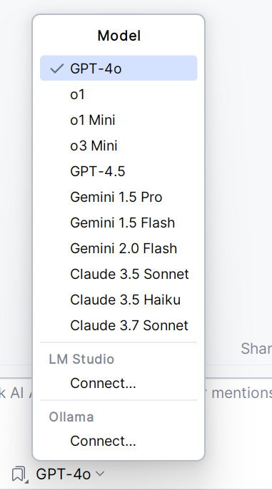
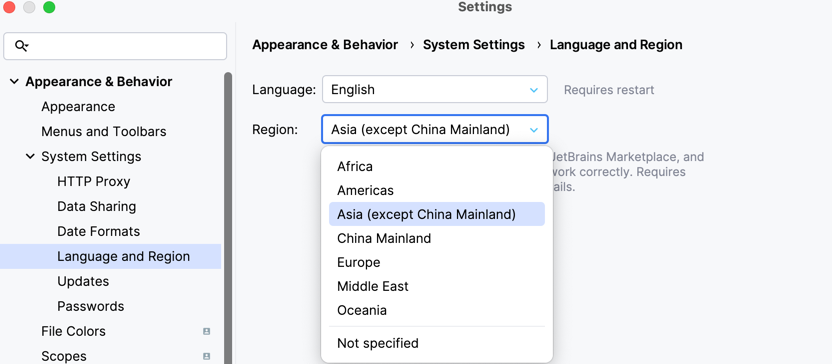
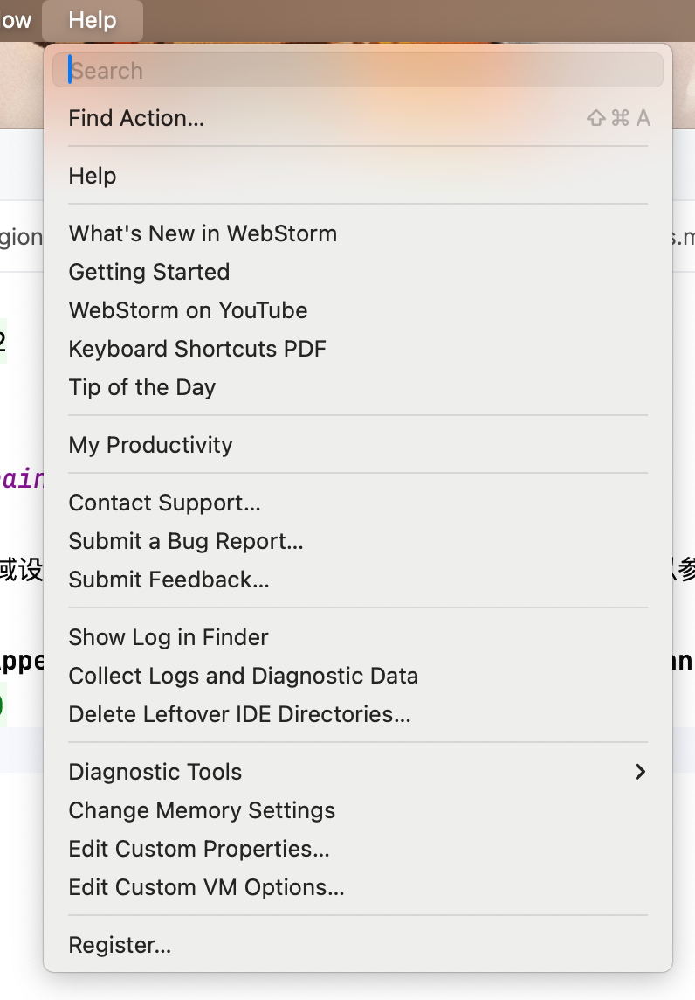
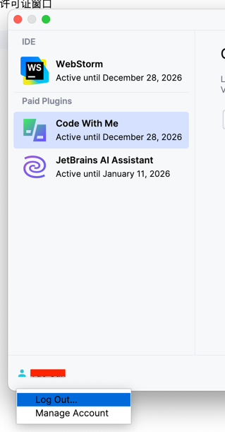
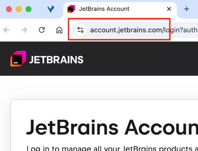

# 🌏 使用全球LLM

国际版使用JetBrains AI提供的全球模型，**需要网络能够访问OpenAI和Claude**

参考第一节"**👨🏻‍💻 IDE中设置区域**"配置好IDE区域后，如果仍然无法使用国际版AI Assistant，可以参考如下步骤：

1. 打开**Settings | Appearance & Behavior | System Settings | Language and Region** 检查确认地区

2. 点击**Help | Register**，打开IDE许可证窗口

3.点击窗口右下角Log out登出账户 

4.再次点击Log in，将打开一个登录页，此时域名**应为国际版的jetbrains.com**而不是jetbrains.com.cn

5.登录账户，激活所有许可证