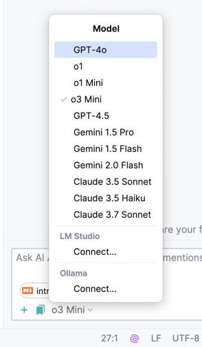

# ❓ 为什么是JetBrains AI

JetBrians AI 集成了**Google，Anthropic，OpenAI，阿里通义**提供的LLM，用量很大且不会掉速。

所有注册JetBrains账户的用户都能试用JetBrains AI。

:::info
**JetBrains AI = AI Assistant + Junie** + 一系列AI相关产品

AI IDE 能力要强于 AI Editor，也就是

**IntelliJ IDE + AI Assistant + Junie** >> Cursor **|** Windsurf **|** GitHub Copilot **|** TongYi **|** Trae ...
:::

目前JetBrains AI提供的模型（标⭐️的代码生成与问答的效果更好）：

**Anthropic:**
- ⭐️**Claude 3.7 Sonnet**
- Claude 3.5 Sonnet 
- Claude 3.5 Haiku

**OpenAI:**
- ⭐**️GPT-4.5**
- gpt-4o
- o1
- o1 mini
- ⭐️**o3 mini** 

**Google：**
- Gemini 1.5 Pro
- Gemini 1.5 Flash
- ⭐**️Gemini 2.0 Flash**

在AI Assistant中能够随时切换使用。此外，AI Assistant的聊天还允许使用由LM Studio和Ollama部署的本地模型。

当你的JetBrains账号拥有AI Pro的订阅后，即可访问全部模型。

**AI Pro的订阅不锁区，完全决定于你的网络环境，只要能访问ChatGPT和ClaudeAI即可解锁全部模型** 

:::danger
因此在过了AI Pro试用期后，可以将JetBrains Account转回中国大陆

在JetBrains国区[以半价购买AI Pro](https://www.jetbrains.com.cn/ai/)的订阅再转出，**35元/月**即拥有所有模型的访问权限。
:::
