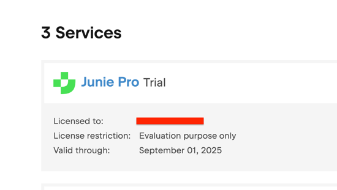
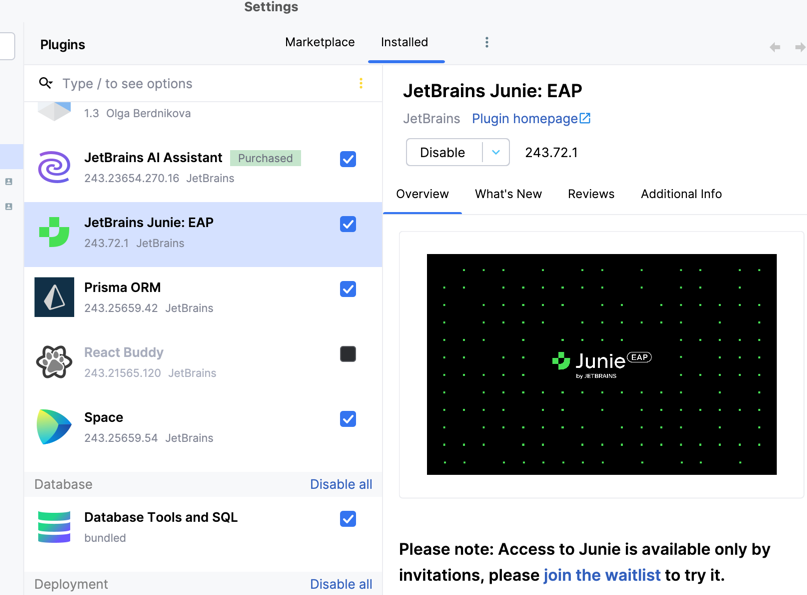
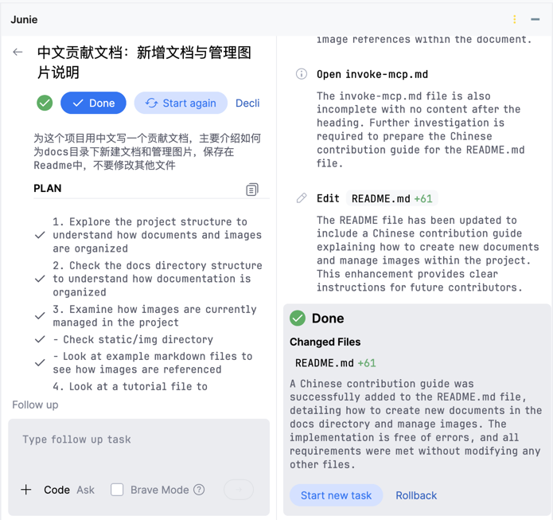

# Junie简单使用教程

Junie以插件形式发布，现在支持`IntelliJ IDEA` `PyCharm` `WebStorm` 三款IDE，`GoLand`正在内测中，其他的IDE支持正在开发中。
支持`Windows` `macOS` `Linux`上的IDE。

## Junie的安装步骤

在获得Junie测试资格后，访问JetBrains Account中的[许可证页面](https://account.jetbrains.com/licenses)，检查确认Junie许可证状态。

在IDE中插件市场安装Junie

安装完成后，即可在侧边打开Junie工具窗口。

## Junie的使用技巧

Junie可以访问IDE中的多项上下文，除了项目静态索引外，也可以访问当前代码静态检查的结果。比如在Problems窗口中发现的问题，可以直接交给Junie进行修复。

使用时，只需将需求交给Junie，Junie将自动规划需求执行步骤，逐步完成任务；因此，你也可以在接续的聊天中指出某个步骤的错误，要求Junie修正。

如果启用`Brave Mode`，Junie在需要在终端执行命令时会直接行动，而不会要求用户许可。

## 使用自定义提示词指导Junie

Junie支持使用类似`.cursor/rules` 的文档指导智能体工作。

Junie将参照使用项目根目录中的`.junie` 下的文件来个性化操作；可以通过运行类似这样的命令自动创建它，作为新项目的第一步：

> 分析项目结构和技术栈，并创建一个 .junie/guidelines.md 文件，包含简明、结构良好的信息，以帮助新开发人员。包括关于组织结构、运行测试、执行脚本和遵循最佳实践的指导。保持内容简短、清晰和实用。

这将触发 Junie 探索项目 30-90 秒，执行类似 'ls' 的命令并生成此文件。请在Junie完成初步探索后仔细审查结果，并添加进一步的自定义需求。

:::tip
良好的指示使 Junie 更有效，而不清晰或不完整的指导可能导致低质量的结果。
:::

另外，您可以从头开始手动创建此文件，并将您现有的任何指南复制到其中。也可以将之前在其他的AI 编辑器中生成的指示导入到`.junie`中。

`.junie` 下的文件可以包含任何格式的说明。例如：
> 生成的单元测试应始终添加到测试文件夹中或使用特定框架。 
> 告知 Junie 您存储库中现有的指南（例如，通过指向正确的文件路径），它将读取并应用这些指南。

你也可以通过VCS共享Junie guideline，团队中的其他成员将自动参照此设置。

一个完全依托Junie实现的示例项目：https://github.com/antonarhipov/mycrm

参考`.junie`目录中的文件组织方式 （如`guideline.md` `implementation.md` `requirements.md`等等)可以进一步提升Junie的工作效果。
