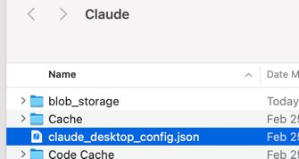
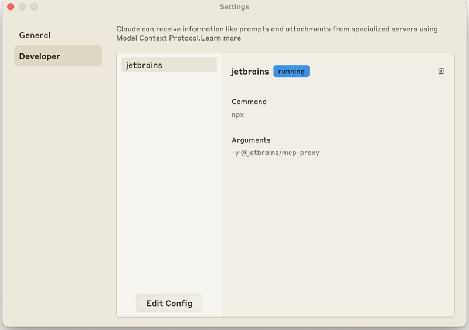

# MCP 插件的安装方式

MCP Server插件支持**所有IntelliJ IDE**，包括 `Rider` `Android Studio`。相比Junie，没有上下文记忆（依赖于外部实现），是与其他AI工作流集成的好工具。

> Goose的AI工作流[集成示例](https://block.github.io/goose/docs/tutorials/jetbrains-mcp/)

MCP Server插件分为两个部分：
* JetBrains Marketplace的[MCP Server插件](https://plugins.jetbrains.com/plugin/26071-mcp-server)


* 负责向MCP Client暴露tools接口的[MCP Proxy](https://github.com/JetBrains/mcp-jetbrains/tree/main)

在MCP Client中配置时仅需通过JSON加载MCP Proxy，其将自动代理流量到IDE中。

:::warning
1. 如果同时开启多个启用MCP Server插件的IDE，则需在MCP Client的配置中指明IDE插件的调用端口。
2. MCP Proxy依赖Node运行时
:::

## 与Claude Desktop的集成

1. 打开Claude Desktop
2. 编辑`claude_desktop_config.json`文件



3. 在其中添加JetBrains MCP Proxy Server为MCP工具，如下：
```json
{
  "mcpServers": {
    "jetbrains": {
      "command": "npx",
      "args": ["-y", "@jetbrains/mcp-proxy"]
    }
  }
}
```
4. 添加完成后打开安装了MCP Server Plugin的IDE，`Claude Desktop | Settings`中出现对应的tools



## 与Cherry Studio的集成

Cherry Studio中调用MCP Server Proxy与Claude Desktop中一致，直接编辑json添加即可。

详细步骤请参考Cherry Studio关于[添加MCP服务器的文档](https://github.com/CherryHQ/cherry-studio-docs/blob/main/advanced-basic/mcp.md)

需要说明的是，Cherry Studio选择了使用bun而非标准Node.js作为Node运行时；

如果机器上已经配置了Node.js运行时，可以使用如下命令绕过bun的安装(以Windows为例）：

```json
{
  "mcpServers": {
    "jetbrains": {
      "command": "C:\\Windows\\System32\\cmd.exe",
      "args": [
        "/c",
        "npx",
        "-y",
        "@jetbrains/mcp-proxy"]
    }
  }
}

```

也可以在Cursor中用此方式调用MCP Server

## 与Windsurf的集成

参照[Windsurf文档](https://docs.windsurf.com/windsurf/mcp)，直接添加MCP Server Proxy为新的tools即可使用

配置完成后，可以在Windsurf中通过对话，寻找JetBrains IDE中打开项目的问题、添加断点、运行调试、生成代码等操作。

:::tip
由于MCP Plugin不具备项目索引，因此相关智能体操作效果与Junie有一定差距

习惯使用VSCode环境与AI Editor的用户，可以借助MCP插件过渡到Junie。
:::