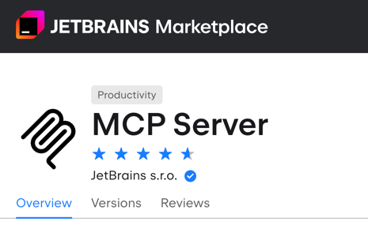

# MCP 插件的安装方式

MCP Server插件支持**所有IntelliJ IDE**，包括 `Rider` `Android Studio`。相比Junie，没有上下文记忆（依赖于外部实现），是与其他AI工作流集成的好工具。

> Goose的AI工作流[集成示例](https://block.github.io/goose/docs/tutorials/jetbrains-mcp/)

MCP Server插件分为两个部分：
* JetBrains Marketplace的[MCP Server插件](https://plugins.jetbrains.com/plugin/26071-mcp-server)

* 负责向MCP Client暴露tools接口的[MCP Proxy](https://github.com/JetBrains/mcp-jetbrains/tree/main)

在MCP Client中配置时仅需通过JSON加载MCP Proxy，其将自动代理流量到IDE中。

:::warning
如果同时开启多个启用MCP Server插件的IDE，则需在MCP Client的配置中指明IDE插件的调用端口。
:::

## 与Claude Desktop的集成

## 与Cherry Studio的集成

## 与Windsurf的集成

