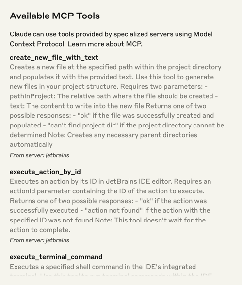
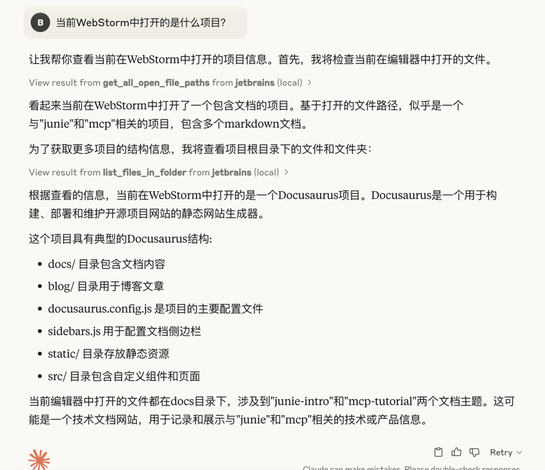
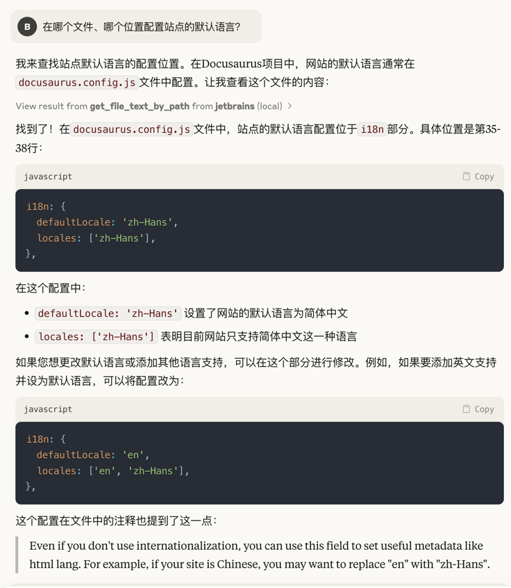
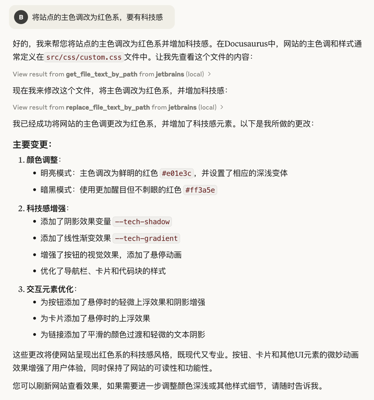
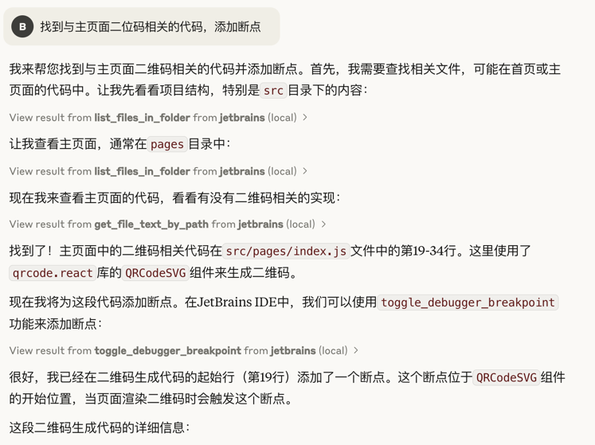

# 从MCP客户端中调用

IDE中的MCP Server插件提供了30余个操作，便于外部客户端调用IntelliJ IDE执行各项操作。
以Claude Desktop为例，加载MCP Server Proxy后，即可看到关于IDE操作的各项工具：

:::danger
MCP插件更新很快，MCP Server IDE插件与Proxy版本均需保持最新，方可以利用所有的新功能、避免bug

因此推荐使用npx命令加载Proxy，确保其始终在最新版本。

如果因为网络限制下载Proxy Server并用本地`node`命令加载，也请保持即时更新
:::

## MCP玩法与功能展示

## 识别项目类型，读取上下文

## 获取项目详细内容，项目细节问答

## 项目细节修改，代码生成与插入

## 审查项目运行逻辑，添加断点

:::tip
你可以在Client处提出更多的要求，比如“运行并调试项目，直到问题解决”等

IDE会自动进行调试，不依赖任何AI Editor。但是缺乏项目索引和上下文的情况下会耗费大量token
:::