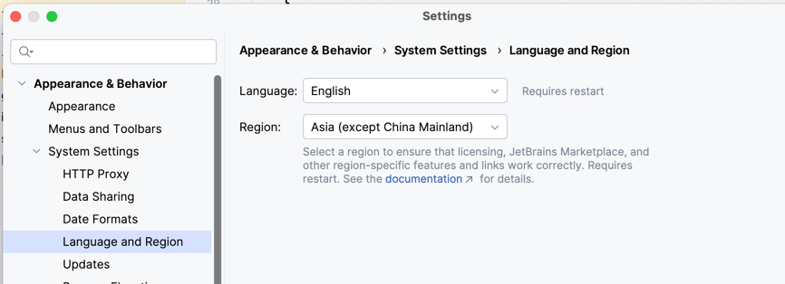

# 👨🏻‍💻 IDE中设置区域

不同的IDE配置大同小异，以IntelliJ IDEA为例

1. 打开 IntelliJ IDEA
2. 点击顶部菜单栏的 **Settings | Appearance & Behavior | System Settings | Language and Region**

3. 在 `Region` 下拉菜单中选择您需要的地区，最好选择与VPN或代理落地一致的区域，加速访问；**选择中国只能使用通义模型**
3. 点击OK或Apply保存更改

