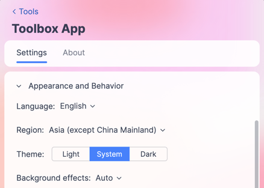

# ⭐️推荐⭐️使用Toolbox设置区域
JetBrains Toolbox 是一个管理 JetBrains 系列开发工具（如 IntelliJ IDEA、PyCharm、WebStorm 等）的应用程序。它提供了以下功能：
- 集中管理所有 JetBrains 产品
- 一键安装、更新和卸载 IDE
- 轻松切换不同版本
- 统一管理许可证
- 自定义区域设置

:::tip 
始终推荐使用JetBrains Toolbox安装和管理所有的IDE，IDE会继承Toolbox中的各项通用设定。
:::

## Toolbox安装步骤
不同的操作系统有细微差异，这里省略介绍。
- 访问 [JetBrains Toolbox 官网](https://www.jetbrains.com/toolbox-app/)，如果速度慢，访问[国内CN官网](https://www.jetbrains.com.cn/toolbox-app/)
- 点击下载Toolbox，**Mac和Linux用户请注意选择芯片架构**

## 修改区域设置

JetBrains Toolbox 允许您修改区域设置，这会影响：
- 界面语言
- 内容区域（**影响JetBrains AI提供的大语言模型**）
- 默认下载服务器位置

### 修改步骤

1. **打开 Toolbox 设置**
    - 点击右上角的齿轮图标（设置）

2. **找到区域设置**
    - 在设置菜单中选择 "**Appearance and Behavior | System Settings | Region**"
 

3. **修改区域**
    - 在 "Region" 下拉菜单中选择您所在的地区
    - **区域设置会影响JetBrains AI提供的模型**，建议选择VPN落点地区加速访问（选择中国大陆地区只有通义，但不用翻墙）
    - 可选修改 "Language"（如果支持您的语言）

4. **应用更改**
    - 点击 "Apply" 或 "OK" 保存设置
    - 某些更改可能需要重启 Toolbox 生效
