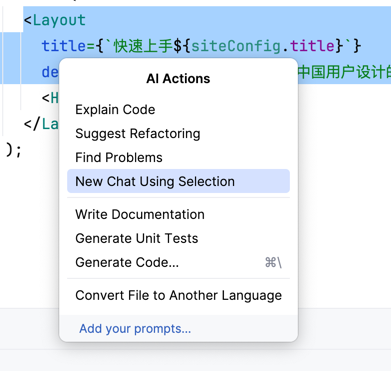
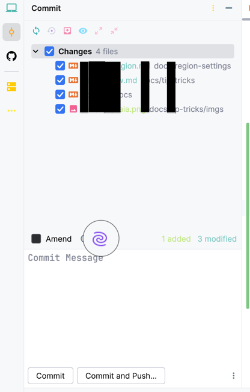
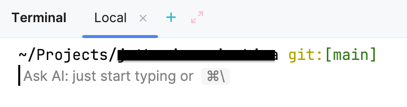

# AI Assistant功能概览

*本文中涉及的功能更新于AI Assistant 2025.1版本*

AI Assistant是一个类似GitHub Copilot的编程助手，其主要功能有问答Chat和改写Edit两大模块

:::tip
AI Assistant中的agent将专注于解决小型编程问题，Junie将接管项目范围内的重复劳动
:::

## 聊天主导的交互模式

AI Assistant工具窗口是聊天的入口，也是最核心的交互模式

### Chat模式的使用

用户可以直接在聊天窗口中提问，通过`@`或`\`引用当前项目文件进行提问、搜索，以及针对整个项目的索引问答

点选联网还可以联网搜索最新的内容，AI Assistant会根据提问自动总结，

:::tip
在询问项目无关的问题时，关闭Codebase索引可以节约用量，更快速地获得结果
:::

### Edit模式的使用

Edit模式最适宜进行小范围的改写与重构，或者针对于新功能、新用法提供代码示例。

Edit模式还在Beta版本，依赖Claude Sonnet 3.7模型

:::tip
为Edit模式启用联网，可以即时查询并使用最新写法和SDK
:::

## 在编码时调用AI Assistant

启用AI Assistant后，用户在编写代码时会自动进行多行补全，**相关的配置在Settings | Editor | General | Inline Completion**中

:::warning
默认的补全策略Completion policy为**Focused**，补全内容少，但效果精准

如果希望获得更多补全建议，将策略调整为Creative，能更快获得补全结果，获得更多补全内容
:::

IntelliJ IDE还有一个功能是Full Line Code Completion（FLCC，中文名全行代码补全），不依赖AI Assistant。依赖本地的小型机器学习模型，一次只能补全一行代码。

:::info
关于FLCC的更多信息可以参考[相关配置文档](https://www.jetbrains.com/help/idea/full-line-code-completion.html)。
:::

## AI Assistant的其他集成（更新中）

### 在编辑器内选择代码作为提示词

按下`Alt + Enter`在上下文快捷菜单选择代码并作为开启新聊天的提示词

:::tip
如果直接从外部粘贴代码到聊天窗口，有可能提示超过token长度限制

从上下文快捷菜单中访问AI操作则不会有这个问题
:::

### 利用AI Assistant生成提交信息

在提交窗口可以选择让AI Assistant生成提交信息，生成相关内容的提示词也可进行自定义

:::tip
比如，你可以配置按照Conventional Commits的标准生成提交信息，或者指定用中文生成提交等
:::

### 在内嵌终端输入自然语言生成CLI命令

如果遗忘了某个CLI命令，可以在终端内调用AI Assistant，生成命令

### 在项目运行时直接根据错误信息进行提问